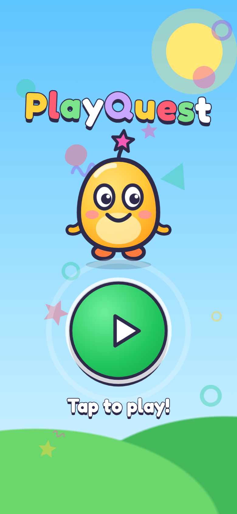
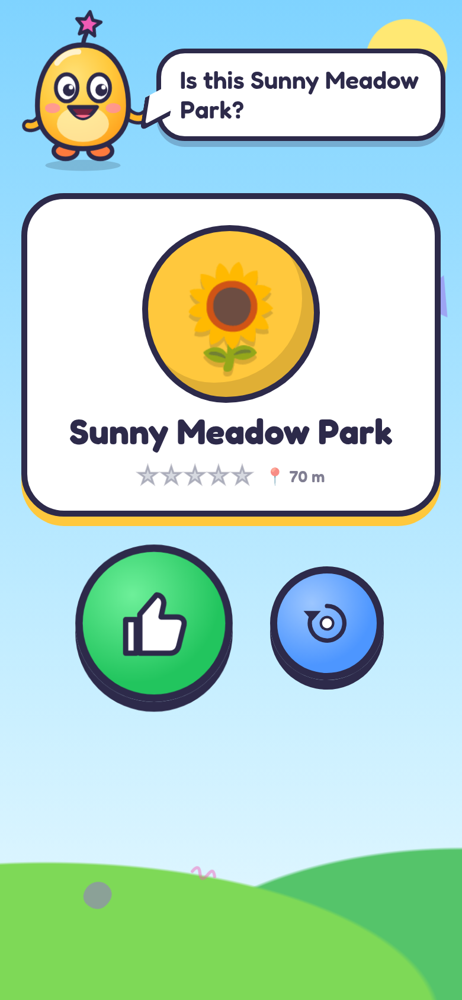
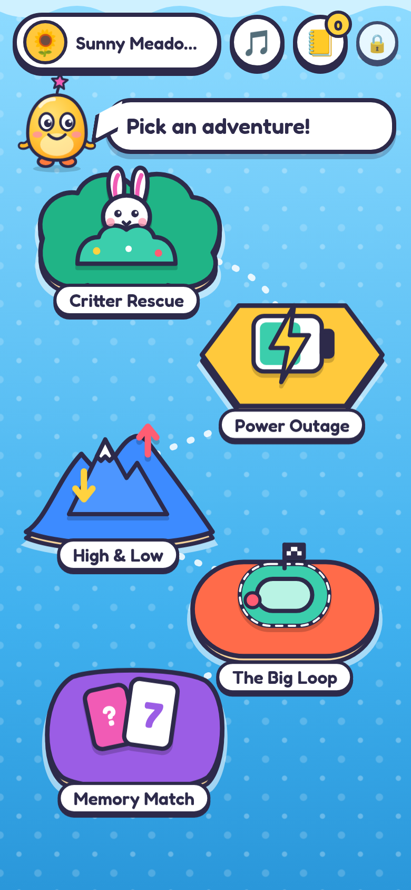
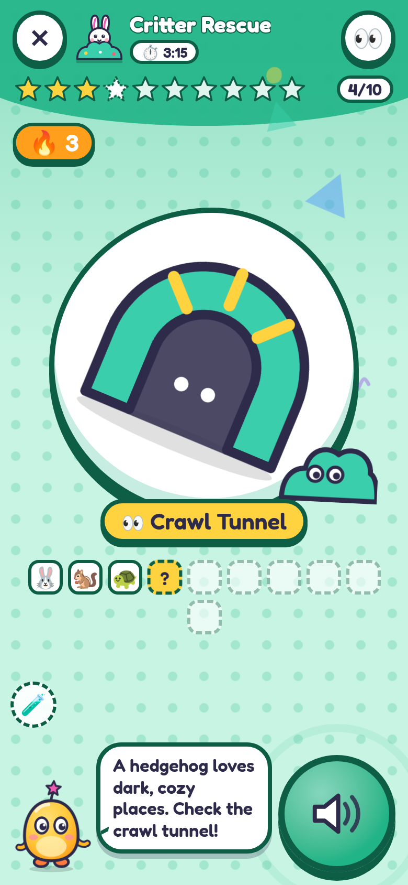
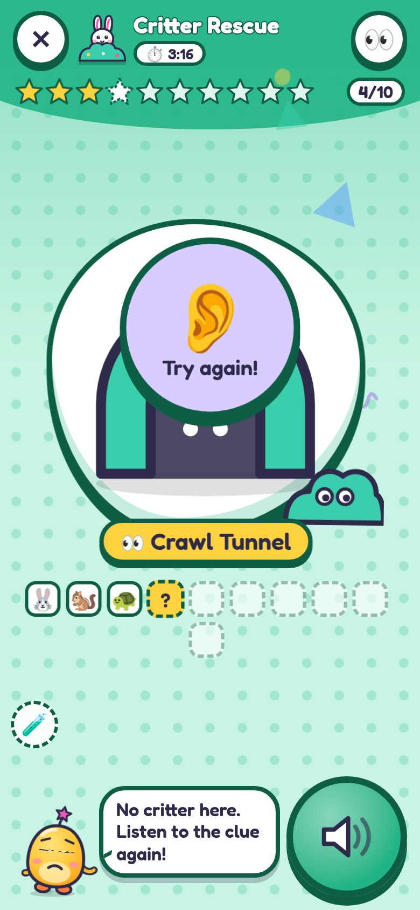
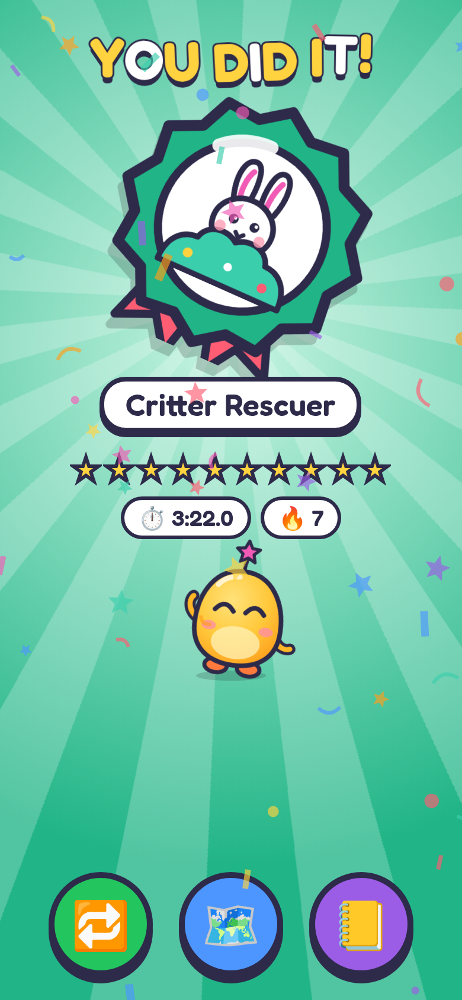
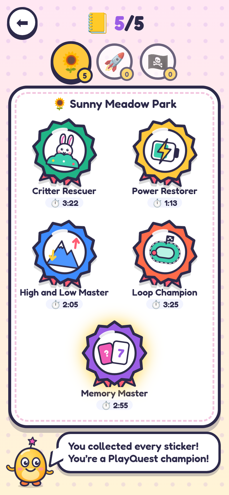

# 🛝 PlayQuest: playground NFC quest games for kids (prototype, redesign)

PlayQuest is a location-based playground game for kids aged about 5–12 (often a solo kid or a little
sibling with a grown-up nearby). Kids walk to ten physical spots on a playground and tap an NFC tag at
each one. **Pip**, a friendly guide character, **speaks every clue out loud**, cheers on correct taps,
gently encourages on wrong ones, and hands out a **badge sticker** after 10 steps.

* **Pre-readers can play:** picture-first screens, giant tap targets, almost no text, and every screen is narrated.
* Installable **PWA**: plain HTML/CSS/ES-module JavaScript with **no build step**. Any static HTTPS host works.
* Works **offline** after the first load (service worker, voice clips cached in the background).
* **Local storage only.** No login, no personal data, and nothing is sent to a server.
* **Many playgrounds**, nearest one found by geolocation. Badges and best times are kept **per playground**.

**🌐 Live demo (main branch):** <https://swainmade-oss.github.io/playquest/> · tag link format:
`https://swainmade-oss.github.io/playquest/?park=123&loc=LOC04`

> ⚠️ Playgrounds, coordinates and clues in `js/data/playgrounds.js` are **SAMPLE DATA** (IDs 123, 456, 789).

| Splash | Is this your playground? | Pick an adventure | Find this! | Uh-oh (gentle) | You did it! | Sticker book |
|---|---|---|---|---|---|---|
|  |  |  |  |  |  |  |

---

## The kid flow (a few big steps, no forms)

1. **Splash: "Tap to play!"** One giant pulsing ▶. The tap also unlocks sound and speech (phones require a tap first).
2. **"Where are we playing?"** Pip looks around (geolocation, nearest playground within ~200 m), then asks
   **"Is this Sunny Meadow Park?"** with a big 👍 and a 🔄 *pick another* button. *Pick another* shows big playground
   bubbles (tap = hear the name, 👍 = go) and a 🔢 number pad for typing a playground number. No keyboard, no forms.
3. **Adventure map:** five **islands** on a wavy sea, each with its own shape, color and character
   (🐰 bush island, ⚡ hexagon power island, ⛰️ mountain island, 🏁 racetrack island, 🃏 card island). Tapping an island
   slides up a big card. Pip explains the game, and a giant ▶ starts it (or ▶ *keep going* / ↺ for a saved game).
4. **3 · 2 · 1 · GO!** in the game's colors, with countdown blips and voice.
5. **Game screen:** dominated by a **giant illustration of WHAT to find** (slide, swings, tunnel…) and a giant
   **🔊 hear-it-again** button. Pip reads the clue (also shown in his speech bubble for readers). Ten stars fill up,
   a 🔥 streak chip appears after 2 in a row, and there's extra sparkle at 3, 5 and 8 in a row.
6. **Win screen:** the badge drops in and shines, with confetti, stars, a fanfare and a dancing Pip. Then 🔁 / 🗺️ / 📒.
7. **📒 Sticker book:** the 5 badges per playground. Earned ones are shown in color with the best time, and locked ones are grey "?" silhouettes. Tabs switch playgrounds.

**Wrong taps are never punishing.** Pip does a gentle wobble, there's a soft "uh-oh", a purple 👂 *Try again!* pop,
an encouraging line, and the clue is repeated.

### The five games

| Game (island) | Badge | Rule | What it looks like |
|---|---|---|---|
| 🐰 **Rescue the Playground Critters** (green bush) | Critter Rescuer | Explore, fixed order of 10 | Giant spot picture with a bush peeking in the corner. Each correct tag pops out the rescued critter (🐰🐿️🐢…) into the rescue row. |
| ⚡ **Power Outage** (night theme) | Power Restorer | Timed, **30 s per step**, step resets | Big **battery that drains** (green → yellow → red, shaking), clock ticks in the last 10 s, "Hurry!" at 10 s. If it runs out there's a blackout flicker and a power-down sound, and **that step restarts** (no advance). Light bulbs light up per station. |
| ⛰️ **High and Low Challenge** (sky blue) | High and Low Master | Sequence, **exact order** | Sky scene for HIGH (▲ red banner) or ground scene for LOW (▼). The ▲▼ sequence row shows progress. **Out-of-order taps don't count.** |
| 🏁 **The Great Playground Loop** (coral) | Loop Champion | Flow, continuous lap | A **racetrack** with 10 numbered stops, a runner and a yellow progress lane. "🌊 Flowing!" turns into "⚠️ Keep moving!" (plus voice) after 45 s at one stop. |
| 🃏 **Memory Mode** (purple) | Memory Master | Memory, hidden numbers 1–10 | Big "Find **3**" card plus a **card board** of the 10 spots. **A wrong tag flips its card and reveals its number** (spoken: "Ooh! This one is number seven. Remember it!"). |

### Grown-ups area (behind a parent gate)

The small 🔒 on the map opens a multiplication question on a keypad. Inside:
* Settings: sound effects, **music**, voice, **natural recorded voice vs device voice**, pocket mode, **test controls**, tag base URL, ▶ test voice.
* **Reset** per playground; "Use my location for this playground" (to try the nearest-playground feature).
* The **one shared set of ten tag links** (see below), printable, with 📋 Copy / ✍️ Write (Android) / ▶ Test.

**Test controls:** when enabled (default on for the demo), games show a small dashed **🧪** button. It opens a panel
with ✅ *Correct tap*, ❌ *Wrong tap* and LOC01–LOC10, so the whole flow can be played without walking to a tag.

**Pocket mode** (👀/🙈 in the game header) hides the picture and all text (a big 👂 and the step count stay). Pip keeps talking.

---

## Audio

### Sound effects + music: synthesized with Web Audio (`js/core/audio.js`)

No sound files are needed. There's a small mixing graph: `sfx` bus, `music` bus with a **ducking** gain, `voice` bus, a synthetic
room reverb, and a master compressor so nothing clips on phone speakers. The 20 designed effects include:

| | |
|---|---|
| `tap` / `pop` | soft bubble pop for every button |
| `select` / `back` | two-note marimba up / down |
| `correct` | marimba hit + rising glockenspiel chime (additive bell partials 1 / 2.76 / 5.4 + reverb) |
| `star` / `sparkle` / `streak` | pentatonic bell arpeggios |
| `uhoh` | a soft cartoon "uh-oh": two filtered triangle-wave notes with vibrato, sliding down (never harsh) |
| `boing` / `whoosh` / `flip` | spring sweep with vibrato, filtered-noise sweep, card-flip click |
| `count` / `go` | countdown blips and a bright chord + whoosh for GO |
| `tick` / `tock` | woodblock clock for the last 10 s of Power Outage |
| `powerdown` / `powerup` | gentle descending "wooo" + flicker, and a rising zap + chime |
| `fanfare` / `tada` | brass-like chords with filter swells, timpani and a bell shower for the badge |

**Background music** is a light procedural 8-bar loop (100 BPM, C–Am–F–G, marimba melody, soft pad, round bass,
shaker). It's quieter and sparser during games and **ducks to ~30 % whenever Pip talks**. Toggle it with 🎵 on the map
(or in Grown-ups). Audio is suspended when the app goes to the background.

`node tools/render-sfx.mjs` renders every effect and 12 s of music offline to WAV (in `/tmp/playquest-sfx` by default) and prints peak/RMS levels, so you can listen and check them.

### Pip's voice: pre-recorded natural clips + speech-synthesis fallback (`js/core/voice.js`)

* **273 clips** cover *every* line the app can say: all fixed narration, every clue for every playground and game,
  every reaction, Memory numbers, playground and spot names. They were generated offline with **Piper TTS** using
  the **en_US-kristin-medium** voice (public-domain LibriVox training data, see `audio/voice/LICENSE.md`).
  Format: mono 22.05 kHz 32 kbps MP3, loudness-normalized to −16 LUFS, with a gentle presence EQ and trimmed silence.
  That's about **12 minutes of speech in ~2.8 MB**. Clips are fetched on demand, and then all of them are warmed into the offline cache in the background.
* Each line maps to its clip by a hash of its normalized text (`js/core/textkey.js`), so any line **without** a clip
  (e.g. a new playground you just added) automatically falls back to **speechSynthesis**.
* The fallback picks the best English voice available: names with *Natural / Neural / Enhanced / Premium*, *Google US English*,
  *Samantha*, *Ava*, *Allison*, *Aria*, *Jenny*… are preferred, and novelty voices are filtered out. It uses rate 0.95 and pitch 1.1.
* Utterances are **queued and never overlap**. Every navigation cancels speech. iOS is unlocked inside the first tap. Pip's
  mouth animates and the music ducks while he talks.

**Re-recording after changing text:**

```bash
python3 -m venv .venv-tts && .venv-tts/bin/pip install piper-tts faster-whisper
curl -L -O https://huggingface.co/rhasspy/piper-voices/resolve/main/en/en_US/kristin/medium/en_US-kristin-medium.onnx
curl -L -O https://huggingface.co/rhasspy/piper-voices/resolve/main/en/en_US/kristin/medium/en_US-kristin-medium.onnx.json
node tools/voice-lines.mjs                                    # lists every line → tools/voice-lines.json
.venv-tts/bin/python tools/make-voice.py --model ./en_US-kristin-medium.onnx --qa
```

Unchanged lines are skipped, and stale clips are removed. With `--qa`, each clip is transcribed with Whisper and re-synthesized
(up to 4 takes) if it doesn't match the text. This catches Piper's occasional swallowed first consonant.

---

## NFC tags: one shared set of ten chips (demo)

**Format (unchanged, so chips that are already written keep working):**

```
https://swainmade-oss.github.io/playquest/?park=123&loc=LOC01   …   &loc=LOC10
```

**Demo rule: every playground uses the same ten physical chips.** A tap counts for **the playground the kid has
selected in the app (or that Pip found by location)**. The `park=123` on the chip is only a **hint**, used when nothing has been
selected on that phone yet. Progress, badges and best times are still **separate per playground**. The Grown-ups page and
its print view show this one set of 10 links, plus which spot each LOC is at each sample playground.
(`SHARED_TAG_PARK_ID` in `js/data/playgrounds.js`.)

> 🔜 **Later:** each playground gets its **own** set of tags (`?park=<its id>&loc=…`), and the tag's park becomes authoritative.
> The link format already carries the park ID, so only the routing rule in `app.parkForTap()` changes.

**What happens on a tap** (all paths go through `app.handleTap()`):

| Situation | Result |
|---|---|
| A game is in progress for the selected playground | The tap **counts** (correct / wrong) for that game. |
| iPhone opens the link cold (new page, no tap yet) | The tap is **counted immediately on load** (saved even if nobody taps the splash). After *Tap to play* the game shows the result with sound + voice. |
| No game in progress | Straight to the **adventure map** of the selected playground ("You found a tag! Now pick an adventure!"). |
| Brand-new phone, nothing selected yet | "Is this your playground?": location if available, otherwise the tag's park as the suggestion, then the map. |
| Android Chrome with the app open | **Web NFC** reads the tag in-page (enable once via the 📡 chip). |

Writing tags: 10 NTAG213/215 stickers labelled LOC01–LOC10, write each link with **NFC Tools** (Write → URL), or use ✍️ on Android
Chrome. **Don't mount directly on metal** (it blocks the read). Use wood/plastic, a spacer, or on-metal tags, at kid height.

---

## Quick start, checks, screenshots

```bash
cd playground-app
python3 -m http.server 8080          # open http://localhost:8080 (phone-size view in DevTools)
npm install                          # playwright-core only; uses your installed Chrome
npm run screenshots                  # full play-through + checks → screenshots/redesign/*.png + tag-links-print.pdf
npm run video                        # same, plus screenshots/redesign/playthrough.webm
npm run art                          # all illustrations → screenshots/redesign/art-sheet.png
```

`npm run screenshots` (390×844, headless Chromium) plays **all five games** with the test controls. It checks the rules
(wrong taps don't advance, the Power Outage reset, High & Low order, Memory hints), resume after reload, badges + best times,
separate progress per park, the shared-chip routing (a `park=123` chip counting for the selected #456 park, the cold link on load,
an in-game tag tap, a link with no game → map, a brand-new phone with location off), the one shared tag table with the exact
`https://swainmade-oss.github.io/playquest/?park=123&loc=LOCxx` links, reset, that all 20 effects + music run, that **every spoken line
came from a recorded clip**, and **no console errors**.

**Screenshots** (`screenshots/redesign/`): 01-splash, 02-park-confirm, 02b-park-pick, 03-game-picker, 04-game-card,
05-countdown, 06-game-critters, 07-wrong-tap, 08-pocket-mode, 09-win, 10-badge-shelf-1, 11-game-power-outage,
12-game-high-low, 13-game-loop, 14-memory-wrong-tap-hint, 14b-game-memory, 15-badge-shelf-full, 16-tag-link-splash,
17-tag-link-to-picker, 18-parent-gate, 19-grown-ups-tags, 20-grown-ups-settings, tag-links-print.pdf, art-sheet.png.
(`playthrough.webm` from `npm run video` is not committed. It's about 4 MB.)

Hosting from a subpath works unchanged (relative paths, `./sw.js` scope). Bump `CACHE` in `sw.js` when deploying changes.

---

## Architecture

```
index.html  manifest.webmanifest  sw.js        offline shell cache (bump CACHE on changes)
css/app.css                                    the whole look: themes, Pip animations, game views, print
fonts/Fredoka.woff2 (+OFL.txt)                 rounded chunky font, Latin subset (SIL OFL 1.1)
audio/voice/*.mp3 manifest.json LICENSE.md     Pip's pre-recorded voice
js/app.js                 router + the single tap entry point app.handleTap() / cold tag links
js/core/audio.js          Web Audio engine: buses, ducking, 20 synthesized SFX, procedural music
js/core/voice.js          voice queue: recorded clips → speechSynthesis fallback, best-voice picker
js/core/textkey.js        text → clip hash (shared with tools)
js/core/session.js        apply tap / tick, streaks, save, record wins (no DOM)
js/core/store.js          localStorage: settings, per-playground progress + active game
js/core/nfc.js geo.js     tag link parse + Web NFC; geolocation + nearest playground
js/data/playgrounds.js    ★ playgrounds, LOC01–LOC10 spots (+ `art`), game orders and clues
js/data/narration.js      ★ every fixed line Pip says
js/games/*.js             the five games as pure rule objects (+ theme colors)
js/ui/art.js              SVG illustrations: 27 playground spots, 5 game characters, badges, floating shapes
js/ui/mascot.js           Pip (SVG) + moods (bounce, blink, talk, cheer, sad, think) + talk()
js/ui/views.js            per-game "find this" views (battery, racetrack, card board, …)
js/ui/fx.js               canvas confetti, sparkles, flying stars, haptics
js/screens/               splash, park, map, countdown, play, win, shelf, parent
tools/                    screenshots/e2e, voice-lines + make-voice (Piper), render-sfx, art preview, icons
```

**Adding a playground:** add it to `js/data/playgrounds.js` (10 spots with `name`, `hint`, `level`, `art`, plus 4 orders;
clues are optional and come from templates). It works immediately with the device voice, and `npm run voice` records clips for it.

## Limitations

* **iPhone:** no Web NFC, so every tag tap is a banner tap plus a page load, and phones need one tap on the splash before sound plays.
  (The tap itself is already counted.) Home Screen web apps on iOS have storage separate from Safari, so play in Safari for the demo.
  iOS has no vibration API.
* Sound design is synthesized and was checked by rendering and level analysis (no listening test on real phones yet). The music is deliberately soft.
* The recorded voice is a neural TTS (Piper "kristin"). It sounds natural but isn't a voice actor. Lines without clips use the device voice.
* The demo's shared chips can't tell playgrounds apart by themselves (by design for now). The selected playground decides.
* Sample coordinates are made up. Use "Use my location for this playground" in Grown-ups to try the 200 m suggestion.
